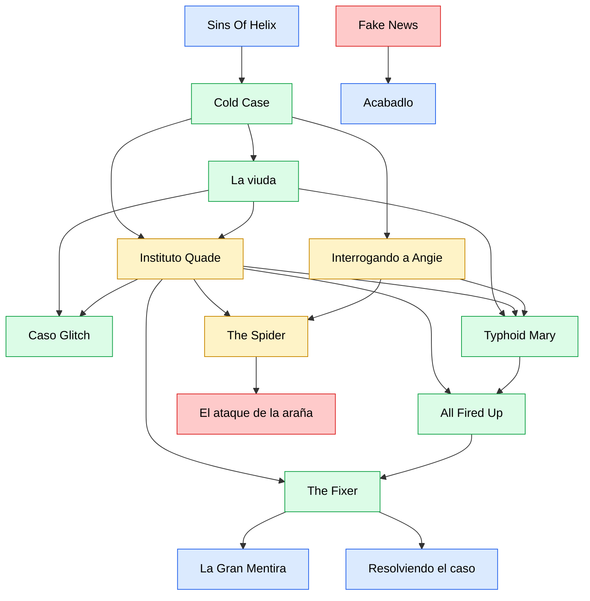

# Blue is Blue

## Index{#index}

- [Diagrama del caso](#diagrama)
- [Acabádlo](./escenas/wrap-it.md)
- [Al rojo vivo](./escenas/all-fired-up.md)
    - [Entrevistando a Lynn](./escenas/all-fired-up.md#interview)
    - [Presionando a Parson](./escenas/all-fired-up.md#pressuring)
- [Caso Glitch](./escenas/glitch.md)
- [Cold Case](./escenas/cold-case.md)
- [El ataque de la araña](./escenas/spider-attack.md)
    - [Files](./escenas/cold-case.md#files)
- [El Manitas](./escenas/the-fixer.md)
    -[Reunión con Shandell](./escenas/the-fixer.md#meeting)
- [Fake News](./escenas/fake-news.md)
- [Instituto Quade](./escenas/instituto-quade.md)
    - [Archivos de investigación](./escenas/instituto-quade.md#files)
    - [Miranda Gaushell](./escenas/instituto-quade.md#gaushell)
- [Interrogando a Angie](./escenas/interrogation.md)
- [La Gran Mentira](./escenas/the-big-lie.md)
- [Resolviendo el caso](./clearing.md)
- [Sins of the Helix](./escenas/sins-of-helix.md#sins)
    - [Angie Arrestada](./escenas/sins-of-helix.md#angieArrested)
    - [Deteniendo a Angie](./escenas/sins-of-helix.md#angieDown)
    - [Flashback](./escenas/sins-of-helix.md#flash)
- [Typhoid Mary](./escenas/typhoid-mary.md)
- [Viuda](./escenas/viuda.md)
    - [La versión de Danica](./escenas/viuda.md#danicaAccount)
    - [El garaje](./escenas/viuda.md#parking)

## Diagrama{diagrama}
[Índice](#index)

  